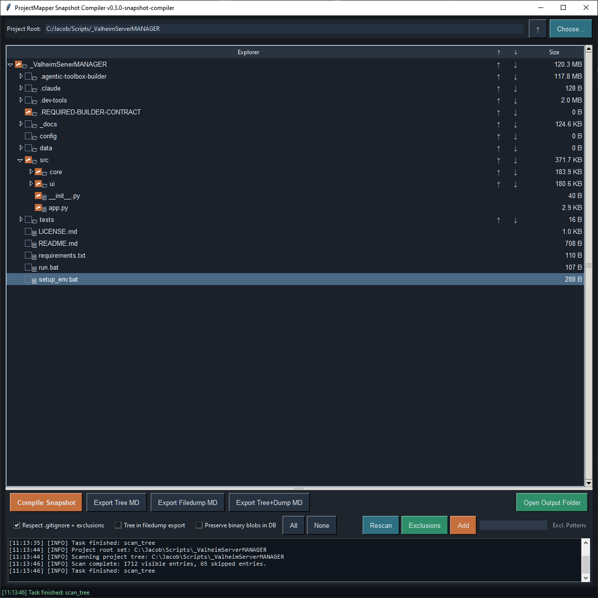

# ProjectMapper Snapshot Compiler

ProjectMapper Snapshot Compiler is a small desktop utility for translating a project folder into a portable SQLite snapshot. It is intended to make project state easier to inspect, share, archive, and hand off to agents or other tools.

The app scans a selected root folder, displays the project tree, allows files and folders to be included or excluded, and compiles the selected project state into a SQLite database.



## Core Purpose

ProjectMapper creates a point-in-time project snapshot that can include:

- Project folder structure
- Selected text-readable file contents
- Inclusion and exclusion state
- Skipped path records
- Exclusion rules
- Local environment hints
- Embedded snapshot manifest
- Optional markdown projections
- Optional binary blob preservation for backup/rehydration use

The SQLite snapshot is the primary truth source. Markdown exports are derived views intended for easier reading or sharing.

## Main Workflow

1. Choose a project root folder.
2. Review the generated folder tree.
3. Check or uncheck files and folders as needed.
4. Add exclusion patterns if necessary.
5. Compile the SQLite snapshot.
6. Optionally export markdown views:
   - Project tree
   - Filedump
   - Combined tree and filedump

## Snapshot Outputs

By default, ProjectMapper writes outputs to a `_projectmapper` folder inside the selected project root.

Typical outputs include:

```text
<ProjectName>_snapshot.sqlite3
<ProjectName>_project_tree.md
<ProjectName>_project_filedump.md
<ProjectName>_project_tree_and_filedump.md
```

## SQLite Snapshot Contents

The snapshot database may include tables such as:

```text
snapshot_metadata
snapshot_manifest
project_tree
project_files
project_blobs
snapshot_exclusion_rules
snapshot_skipped_paths
snapshot_mapper_state
snapshot_environment
snapshot_outputs
snapshot_errors
```

`project_files` stores selected text-readable files.

`project_blobs` is optional and is used only when binary blob preservation is enabled.

## Markdown Exports

The project tree export is useful as a lightweight surface map of the project. It can be shared without including the full file contents, allowing an agent or reviewer to see the project shape and request specific follow-up files when needed.

The filedump export contains selected captured text files.

The combined export places the project tree before the filedump for easier single-document handoff.

## Binary Preservation

Binary blob preservation is optional and disabled by default.

When enabled, selected binary-like files can be stored in the SQLite snapshot as blobs. This allows the snapshot to serve more like a backup or rehydration artifact, while the default mode remains lighter and more suitable for agent communication.

## Running

From the project root:

```bash
python src/app.py
```

Or, depending on the local environment:

```bash
py src/app.py
```

## Notes

ProjectMapper is currently implemented as a single-file Tkinter application. The internal source is organized with section markers to keep the monolith patchable and easy to evolve.
