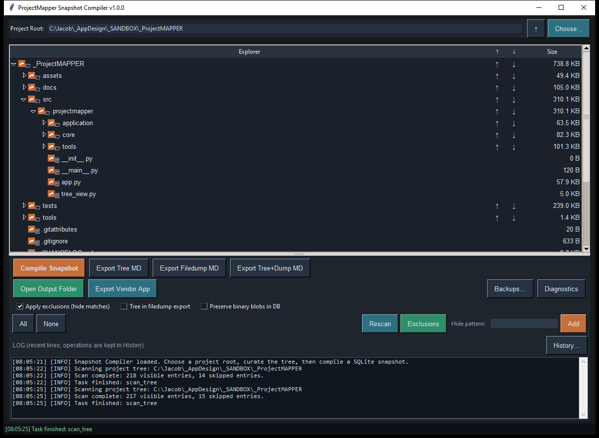

# ProjectMapper

ProjectMapper is a desktop workbench for moving a codebase between you, a reviewer
and an AI model, in both directions:

- **Out:** choose files in a project tree and compile a portable SQLite snapshot.
  Export it as a lightweight tree map, a full file dump, or both.
- **Back in:** apply the JSON search/replace patches a model returns, to one file or
  across a project. Every file is validated and shown as a diff; multi-file changes
  apply only after you approve the exact preview.

It runs locally, needs only Python and Tkinter, and has no third-party runtime
dependencies. See [CHANGELOG.md](CHANGELOG.md) for release notes. Development plans
and architecture notes are indexed in [docs/README.md](docs/README.md).

## Install and quick start

Requires Python 3.10+ with Tkinter (included with the python.org installers).

**Platform:** tested on Windows 10 with Python 3.10–3.14. macOS and Linux are expected
to work (the app uses only the standard library and Tk) but have not been tested yet.

```bash
pip install .                      # from a checkout or vendor export
projectmapper path/to/your/project # or: python -m projectmapper path/to/your/project
```

On Windows without installing: run `setup_env.bat` once, then
`run.bat path\to\your\project`. With no folder argument, ProjectMapper opens the
current directory.

Then: review the tree, uncheck what you do not want, click **Compile Snapshot**, and
use **Export Tree MD** / **Export Filedump MD** to share it. To bring changes back,
right-click a file (**Tokenizing Patcher…**) or a folder (**Project Patcher…**).



## Core Purpose

ProjectMapper creates a point-in-time project snapshot that can include:

- Project folder structure
- Selected text-readable file contents
- Inclusion and exclusion state
- Skipped path records
- Exclusion rules
- Local environment hints
- Embedded snapshot manifest
- Optional markdown projections
- Optional binary blob preservation for backup/rehydration use

The SQLite snapshot is the primary truth source. Markdown exports are derived views intended for easier reading or sharing.

## Main Workflow

1. Choose a project root folder.
2. Review the generated folder tree.
3. Check or uncheck files and folders as needed.
4. Add exclusion patterns if necessary.
5. Compile the SQLite snapshot.
6. Optionally export markdown views:
   - Project tree
   - Filedump
   - Combined tree and filedump

## Tree navigation and selection

Folders load their displayed children when expanded, in small batches. The complete
scan and capture selection exist independently of the display: unchecked folders
apply to all descendants, including unopened ones. Individual children can override
that state. Expanding or collapsing a folder does not change capture selection.

Rescan discovers external changes and preserves surviving open folders, focus and
scroll position. New paths inherit their parent's selection. Paths absent from a
completed scan (including excluded paths) lose their individual overrides; if they
return, they inherit again. Changing roots resets selection. Displayed folder sizes
sum files remaining after exclusions. Linked entries and Windows junctions are
skipped rather than traversed.

## Managing Exclusions

Click **Exclusions** to open the resizable rule manager. It lists built-in rules,
custom filename patterns, and supported rules imported from the current root's
`.gitignore`, with their source and match type.

- Check **Exclude (hide)** to hide matching files/folders from the mapper. Uncheck it
  to allow matches, unless another rule excludes them. The tree refreshes automatically.
- Use **Select** to choose rows for batch actions without changing what the mapper shows.
- **Select All** and **Deselect All** change the row selection.
- **Exclude Selected** turns on the selected exclusion rules; **Allow Selected** turns
  them off. **Delete Selected** removes the selected rules.
- Add a filename pattern such as `*.tmp` directly in the manager. Patterns use
  wildcards, not regular expressions.

Changes last for the current app session. Deleting an imported rule removes it
from the app's exclusion policy without editing `.gitignore`; rescanning does not
restore it during that session. Overrides for imported rules are scoped to their
project root. Built-in and custom rule changes apply across roots in the session.
Unchecking the main **Apply exclusions (hide matches)** switch allows matches without
clearing the individual rule checkboxes. A path matching multiple rules remains
excluded until all matching rules are disabled or deleted. Compile a new snapshot
after changing exclusions to capture the updated tree and rule states.

## Single-File Transformations

Right-click a file in the project tree and choose **Tokenizing Patcher…**
(or focus the file and press **Shift+F10**). This opens the selected file without
changing its snapshot inclusion checkbox.

1. Paste a JSON patch or use **Load Patch JSON**. **Copy Schema** copies an example.
2. Choose **Validate / Preview** to resolve all hunks and inspect the diff.
3. Choose **Apply to Result** to inspect the complete transformed text.
4. Choose **Save Result** to write the result to the target, or enable **Save as
   version** and supply a suffix such as `_v2` to create a sibling file.

Click the **&** between Validate and Apply to link them. The group turns purple;
either button then validates the current patch and applies it to Result in one
click. Failed validation stops the chain. Click **&** again to restore separate
actions. Saving remains a separate step in both modes.

```json
{
  "hunks": [
    {
      "description": "Change the greeting",
      "search_block": "print('Hello')",
      "replace_block": "print('Welcome')",
      "use_patch_indent": false
    }
  ]
}
```

Hunks match complete lines, first exactly, then with leading/trailing spaces and
tabs ignored. Every hunk is located against the original source; missing,
ambiguous, and overlapping matches reject the entire patch. An empty replacement
deletes the matched lines. By default, replacements inherit the target's base
indentation and retain the replacement's relative indentation. A hunk's
`use_patch_indent: true` keeps its supplied indentation; **Force patch indentation**
overrides all hunks, including those explicitly set to false.

The patcher supports UTF-8 text, preserves a UTF-8 BOM and target newline style,
and preserves line endings outside replaced blocks. Patch edits invalidate the
preview. Saving refuses to overwrite externally changed source files or existing
version files. Source, diff, and result are separate views; the diff is never saved
as source. A successful save refreshes the tree and requires a new snapshot before
exporting in the current app session. **Keep backup** is opt-in and stores the
file's previous bytes as a backup generation immediately before an in-place save
(see [Backups](#backups)). Every backed-up save creates a new generation.

The patcher implementation lives in `src/projectmapper/tools/patcher.py` and
`src/projectmapper/tools/patcher_ui.py`.
The disposable `.parts/` folder is reference material only: it is never imported,
is not included in vendor exports, and is protected from patcher writes. It can
be removed without affecting the application.

## Creating New Text Files

Right-click a folder or empty space within the tree and choose **New Text File…**
to open TextTOUCHER. The destination starts at the clicked folder, or at the
current project root when clicking empty space. The context menu is available
on files, folders, and empty space: **New Text File…** is disabled on files, and
**Tokenizing Patcher…** is disabled on folders and empty space.
**Choose Folder…** changes the destination.

Enter a name, choose an extension, and optionally paste or type content. An
extension typed in the name takes precedence over the preset. Choose **(None)**
for an extensionless file; dotfiles such as `.gitignore` keep their exact names.
**Append date/time to filename** adds a timestamp before the extension.

**Create File** writes UTF-8 text exactly as entered (including empty content),
refreshes the project tree, and requires a fresh snapshot before exporting in the
current session. Files matching exclusion rules remain hidden until allowed.
The form clears after success so another file can be created in the same folder.
Existing files are never overwritten, and failed creation keeps the form content.
The `.parts/` reference folder is protected from creation as well as patching.

The implementation is in `src/projectmapper/tools/text_toucher.py`; it has no dependency on the
reference script or `.parts/` folder.

## Deleting Files

Right-click a file and choose **Delete File…**. A blocking confirmation shows the
full target path and defaults to **No**. Only an explicit **Yes** deletes the file;
closing or declining the dialog leaves it untouched. Deletion is permanent (not
the Recycle Bin). Folders, empty tree space, and `.parts/` references cannot be
deleted through this operation. If the file changes while approval is pending,
the deletion is refused so it can be reviewed again. Successful deletion refreshes
the tree and requires recompilation before snapshot exports in the current session.

## Text Editor

Right-click a file and choose **Open Text Editor…** for a native dark-theme editor.
It supports guarded open/save/save-as, undo/redo, read-only mode, find-next,
confirmed replace-all, dirty-state tracking, and a direct **Tokenizing Patcher…**
button. Saves preserve the existing UTF-8/BOM and newline protections and refresh
the mapper snapshot state. Unsaved changes are confirmed before opening another
file or closing the window.

The editor is implemented in `src/projectmapper/tools/text_editor.py`. The integration keeps the
reference editor's useful workflow while avoiding its external Qt/pywebview and
HTML asset dependencies.

## Project Patches

Right-click a folder or empty tree space and choose **Project Patcher…**. A project
patch uses the same hunk schema as the single-file patcher, grouped by safe relative
paths:

```json
{
  "version": 1,
  "files": [
    {
      "path": "src/app.py",
      "sha256": "optional-original-file-hash",
      "hunks": [
        {"search_block": "old", "replace_block": "new"}
      ]
    }
  ]
}
```

A new window starts with an empty manifest. **Copy Schema** copies a complete example
to give a model or reviewer. **Add File…** inserts a safe relative entry with the
file's current hash and a starter hunk (a line that occurs once in the file). If the
untouched example is still in the manifest, it is replaced.

**Validate / Preview** checks every file against its original content and reports all
problems at once. Each message names its file and hunk, such as
`c.py: Hunk 1: Search block not found.` Ambiguous, overlapping, changed-hash,
non-UTF-8 and binary targets are reported per file. Malformed JSON, duplicate entries,
missing files, and outside-root or `.parts/` paths reject the whole manifest.

The review panel lists every file with its status (changed, no change, or error, plus
"empty result" and "final newline" notes), additions, deletions and hunk count.
Select a file to see its **Source**, colour-highlighted **Diff** and full **Result**.
The current diff hunk is highlighted in all three views. Move with the ◀/▶ buttons or
the keyboard, and the header shows your position, such as "File 2/5 · Hunk 1/3":

| Key | Action |
| --- | --- |
| Alt+↓ / Alt+↑ | Next / previous file |
| F8 / Shift+F8 | Next / previous hunk |
| Ctrl+Enter | Validate |
| Ctrl+Tab | Leave the manifest editor (Tab inserts a tab character there) |

**Apply Project Patch** is available only when every file is valid, and it applies
exactly the reviewed plan. The blocking approval dialog lists each file's +/− counts
and the totals. Editing the manifest or options clears the review. All files are
rechecked before writing; a write failure rolls back the files already replaced.
Application is all-or-nothing: to leave out one change, remove it from the manifest
and validate again. Project patches transform existing text files only. New files,
deletions, renames and binary operations remain separate tools.

The project patcher uses the same linked **&** action group as the single-file
patcher. Unlinked, **Validate / Preview** and **Apply Project Patch** are separate
steps. Linked, either button validates the complete manifest and proceeds to the
approval dialog; a failed validation stops the chain. Enable **Keep backups** (beside
Apply) to store every changed file's original bytes as one backup generation. It is
created after validation and before any replacement; if it cannot be written, nothing
is replaced.

If a write fails partway and a replaced file cannot be rolled back (for example
because it was edited externally in the meantime), the result is **recovery
required**. The originals of those files are always saved in a `recovery` generation,
even with backups off, and the message names it. If they cannot be saved, the
message says so. Files inside `_projectmapper/` cannot be patch targets.

## Backups

Backups are stored as **generations**. Each is a folder holding the backed-up bytes
and a `manifest.json` with each file's path, SHA-256, size and mode. The manifest is
written last, so an interrupted backup is never mistaken for a usable one.

- Files inside the project root back up to `<root>/_projectmapper/backups/`. That
  folder is excluded from snapshots, vendor exports and project patches.
- Files outside the project root back up to a per-user store:
  `%LOCALAPPDATA%\ProjectMapper\backups` on Windows,
  `~/Library/Application Support/ProjectMapper/backups` on macOS, and
  `$XDG_STATE_HOME/projectmapper/backups` (default `~/.local/state/...`) elsewhere.
  Set `PROJECTMAPPER_USER_BACKUPS` to use another folder.
- Kinds: `backup` (you asked for it), `pre-restore` (the current bytes, saved before a
  restore) and `recovery` (originals saved when a rollback could not complete).
- A generation is usable only if its manifest is valid and every stored file matches
  its recorded SHA-256. Anything else in the store is ignored and never modified.
- ProjectMapper no longer writes sibling `.bak` files, and it never touches existing ones.

Click **Backups…** in the main window to open the Backups window (F5 refreshes):

- The list shows every generation in the project and user stores, with its time,
  scope, kind, file count, size and status. Recovery generations are highlighted;
  incomplete or corrupt ones are shown in red and can never be restored or deleted.
- Select a generation, then a file, to compare the **Current** file with the
  **Backup** (and a coloured **Diff**).
- **Restore File…** or **Restore All Files…** asks for approval. The current contents
  are saved first as a `pre-restore` generation. If a file changed since you
  selected it, or the backup no longer verifies, nothing is written.
- **Clean Up…** deletes, after approval, all but the newest N `backup` and
  `pre-restore` generations of the chosen store. Recovery generations are never
  included; remove one only by selecting it and choosing **Delete Selected…**.
  Nothing is ever deleted automatically.

## History and errors

Click **History…** in the log panel header to see what happened this session. Every
operation is listed once, newest first, whether it came from the desktop or another
client. Each row shows its time, action, origin, status (including whether an approval
was approved or denied), duration and target. Failed and recovery-required operations
are highlighted, and the status line counts those that need attention.

- Filter by **Category**, **Outcome** or text (**Contains** matches the action, paths,
  origin, error text and backup names). F5 or **Refresh** reloads; **Clear** resets
  the filters. The list also updates by itself while the window is open.
- Select an operation to see its details: the labelled error and its code, approval,
  progress count, affected paths, and any backup generations named. **Open Backups…**
  jumps to the Backups window when a generation is named.
- History is kept for the session only (the most recent 500 operations; unfinished
  ones are never dropped). It records outcomes and paths, never file contents. A long
  operation's progress is counted rather than listed, so it cannot push other
  operations out.
- Unexpected internal failures (a window callback, a background task, an event
  listener) appear as `internal` operations with the traceback in their details, plus
  one log line; nothing pops up.

Error messages read "Label: detail", for example "The file changed on disk: …", with
one label per error code. The main log keeps its most recent 2,000 lines; progress is
shown in the status bar rather than the log.

## State, diagnostics, and maintenance

Freshness is tracked in one project-state record shared by scans, exclusions,
file transformations, and snapshot compilation. Any transformation or exclusion
change invalidates exports until a new snapshot is accepted. The **Diagnostics**
button performs health checks for imports, the selected root, output write access,
SQLite availability, and optional `.parts/` isolation, then records the result in the
log and a small report dialog.

Shared atomic writes, diff accounting, and tool-window styling live under
`src/projectmapper/core/` and `src/projectmapper/tools/ui_base.py`; the disposable `.parts/` folder is never a
runtime dependency. Directory sizes are accumulated during the tree walk so nested
folders are not scanned repeatedly.

## Blank-Slate Vendor Export

ProjectMapper can export a clean, vendible copy of itself for external testing.
This is separate from project snapshot exports. It creates an installable app
folder and zip under `vendor_exports/` with no Git history, virtual environment,
Python caches, previous `_projectmapper` records, SQLite snapshot databases,
logs, local `.env*` files, or generated export history. Vendor export copies a
source checkout, so it is unavailable (the button is disabled) when ProjectMapper
runs as an installed package.

From the UI, use:

```text
Export Vendor App
```

From the command line:

```bash
python tools/export_vendor_app.py
```

The generated package includes an `INSTALL_FRESH_START.md` file for testers.
The expected fresh-start test is:

1. Copy or unzip the vendor export into a blank external test project.
2. Run `setup_env.bat`.
3. Run `run.bat`.
4. Choose a project root in the app and compile a new snapshot.

New test records are created only when the exported app is run against a chosen
project root.

## Snapshot Outputs

By default, ProjectMapper writes outputs to a `_projectmapper` folder inside the selected project root.

Typical outputs include:

```text
<ProjectName>_snapshot.sqlite3
<ProjectName>_project_tree.md
<ProjectName>_project_filedump.md
<ProjectName>_project_tree_and_filedump.md
```

## SQLite Snapshot Contents

The snapshot database may include tables such as:

```text
snapshot_metadata
snapshot_manifest
project_tree
project_files
project_blobs
snapshot_exclusion_rules
snapshot_skipped_paths
snapshot_mapper_state
snapshot_environment
snapshot_outputs
snapshot_errors
```

`project_files` stores selected text-readable files.

`project_blobs` is optional and is used only when binary blob preservation is enabled.

## Markdown Exports

The project tree export is useful as a lightweight surface map of the project. It can be shared without including the full file contents, allowing an agent or reviewer to see the project shape and request specific follow-up files when needed.

The filedump export contains selected captured text files.

The combined export places the project tree before the filedump for easier single-document handoff.

## Binary Preservation

Binary blob preservation is optional and disabled by default.

When enabled, selected binary-like files can be stored in the SQLite snapshot as blobs. This allows the snapshot to serve more like a backup or rehydration artifact, while the default mode remains lighter and more suitable for agent communication.

## Development

Launching is covered in [Install and quick start](#install-and-quick-start). To work on
ProjectMapper itself:

```bash
pip install -e ".[dev]"
python -m pytest            # full suite; tests/benchmark_tree.py holds opt-in benchmarks
```

`pytest.ini` sets `--capture=sys`. Keep it: pytest's default fd-level capture swaps the
process's standard handles around every test, and on Windows that intermittently stops Tk
from starting ("Can't find a usable init.tcl"). The application itself never swaps them.

## Notes

Tk presentation lives in `src/projectmapper/app.py` and `src/projectmapper/tree_view.py`. Shared actions and
coordination live in `src/projectmapper/application/`, filesystem and snapshot services in
`src/projectmapper/core/`, and transformation engines and their windows in `src/projectmapper/tools/`.
Current architecture and implementation status are indexed in `docs/README.md`.
